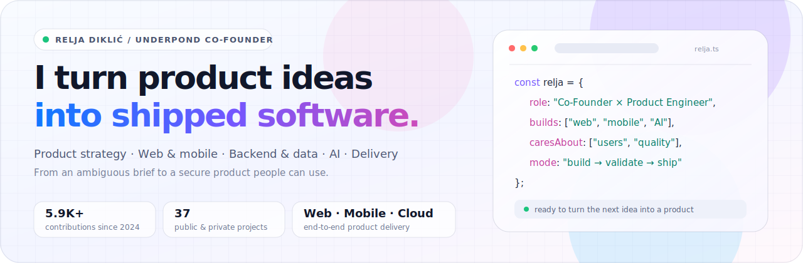
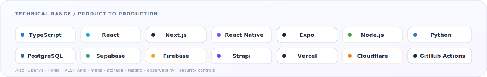
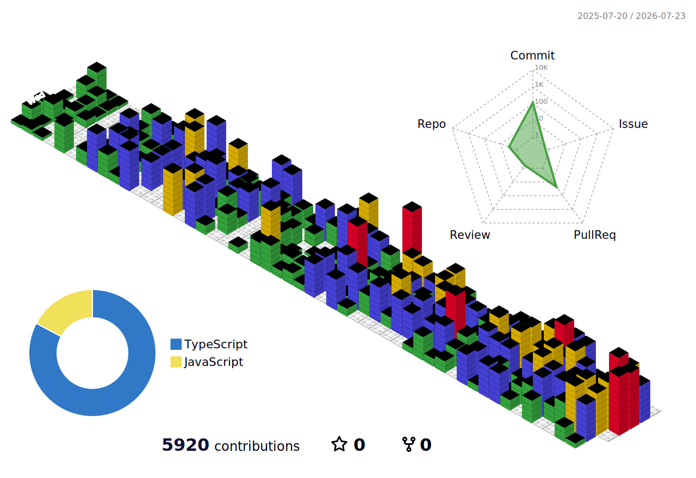

  <picture>
    <source media="(prefers-color-scheme: dark)" srcset="./assets/hero-dark.svg">
    <source media="(prefers-color-scheme: light)" srcset="./assets/hero-light.svg">
    
  </picture>

  <strong>Full-Stack Developer and Product Manager at <a href="https://www.underpond.io">Underpond</a></strong>
   
  I take products from an early idea to a working release.

  <a href="#selected-work">Selected work</a> ·
  <a href="#technical-range">Technical range</a> ·
  <a href="#the-build-trail">Build trail</a> ·
  <a href="https://github.com/RexDotDev?tab=repositories">Repositories</a>

---

## I like building the whole product

Hi, I'm Relja. I work as a full-stack developer and product manager at [Underpond](https://www.underpond.io). I enjoy being close to the whole process: figuring out what is worth building, choosing a practical technical approach, writing the code and getting the product into people's hands.

Most of my work is in TypeScript across web and mobile. I also work with backend services, databases, CMS platforms, cloud infrastructure and AI integrations.

I have also built an AI chatbot for a service business. It answers customer questions, calculates pricing, books pickup and delivery, and connects each request with route planning and the operations dashboard.

| Product | Engineering |
| --- | --- |
| Turn rough ideas into clear scope, useful flows and sensible priorities. | Build the frontend, mobile app, backend, data layer, integrations and deployment. |
| Stay close to feedback and make tradeoffs based on what matters. | Keep the code secure, testable and easy for other people to work with. |

## Selected work

Here are a few products I've worked on, along with two open source projects I maintain.

<table>
  <tr>
    <td width="50%" valign="top">
      <h3>🏆 WinnerArc</h3>
      
A productivity app for iOS and Android with planning, 21-day programs, focus timers, progress tracking, reminders and subscriptions.

      
<code>Expo</code> <code>React Native</code> <code>Firebase</code> <code>Redux</code> <code>React Query</code>

      
<a href="https://apps.apple.com/rs/app/winnerarc/id6746265207">App Store</a> · <a href="https://play.google.com/store/apps/details?id=com.winnerarc.application">Google Play</a>

    </td>
    <td width="50%" valign="top">
      <h3>🏙️ Takween AlDar</h3>
      
A bilingual real estate platform for Dubai. My work includes the frontend, CMS, property search, integrations, localization, maps, forms, SEO and monitoring.

      
<code>Next.js</code> <code>TypeScript</code> <code>Strapi</code> <code>Maps</code> <code>i18n</code>

      
<a href="https://takweenaldar.ae/en">Visit product</a>

    </td>
  </tr>
  <tr>
    <td width="50%" valign="top">
      <h3>📈 Takween Advisory</h3>
      
A bilingual business advisory website for the UAE, built around clear service pages, useful content, lead forms and reliable content operations.

      
<code>Next.js</code> <code>TypeScript</code> <code>Strapi</code> <code>Motion</code> <code>SEO</code>

      
<a href="https://takweenadvisory.ae/en">Visit product</a>

    </td>
    <td width="50%" valign="top">
      <h3>🧠 Coach Board</h3>
      
A tactical board for coaches across several sports. It includes drawing tools, configurable players and equipment, templates, session planning, sharing and exports.

      
<code>React</code> <code>TypeScript</code> <code>Canvas</code> <code>Product UX</code>

      
<a href="https://www.coachboard.app">Visit product</a>

    </td>
  </tr>
  <tr>
    <td width="50%" valign="top">
      <h3>🕵️ Mafia (open source)</h3>
      
A real-time multiplayer Mafia game with private rooms, roles, night actions, voting, narrator controls and chat. Supabase handles the backend, security rules and realtime state.

      
<code>TypeScript</code> <code>React</code> <code>Supabase</code> <code>Vercel</code>

      
<a href="https://github.com/RexDotDev/mafia">Explore repository</a>

    </td>
    <td width="50%" valign="top">
      <h3>🏀 Baller Imposter (open source)</h3>
      
A local pass-and-play basketball party game with NBA and EuroLeague modes. It supports custom roles, player and team rounds, responsive play and resilient image fallbacks.

      
<code>TypeScript</code> <code>React</code> <code>Vite</code> <code>Vitest</code>

      
<a href="https://github.com/RexDotDev/baller-imposter-game">Explore repository</a> · <a href="https://baller-imposter-game.vercel.app">Play live</a>

    </td>
  </tr>
</table>

  
<strong>More things I've built</strong>

   

- **LugTranz:** a Python logistics backend with APIs, database migrations, automated tests and Docker environments for development, staging and production.
- **WhatsApp and Voice AI scheduling:** appointment workflows built with OpenAI, Twilio, Next.js, Express and PostgreSQL, plus an admin dashboard and verification tools.
- **Tepih Servis operations and chatbot:** pickup and delivery booking, pricing, maps, route planning, fleet scheduling, operations dashboards and bot evaluation.
- **Event media platform:** QR-based guest uploads and galleries using Cloudflare R2 and Supabase, with admin controls, ZIP exports, validation, rate limits and cost safeguards.
- **Digital event experience:** a responsive invitation with animated media, a live countdown, RSVP management, maps and production deployment.
- **Mobile commerce:** Expo and React Native customer and admin apps with Firebase authentication, catalog and order management, cart, checkout and media workflows.
- **Headless real estate CMS:** Strapi content models for properties, agents, developers, categories, reusable components, media, permissions, APIs and localization.
- **Learning product:** an interactive quiz with practice and exam modes, several question types, timed sessions, lifelines, scoring, review and local progress.

## Technical range

<picture>
  <source media="(prefers-color-scheme: dark)" srcset="./assets/stack-dark.svg">
  <source media="(prefers-color-scheme: light)" srcset="./assets/stack-light.svg">
  
</picture>

### How I work

- **Understand the real problem first.** I would rather cut the wrong feature early than polish it later.
- **Follow decisions through the whole stack.** Interface choices affect APIs, data and operations, so I treat them as one system.
- **Treat security as part of the product.** Secrets stay server-side, inputs and uploads are validated, and access and cost limits are explicit.
- **Make the repository easy to join.** Setup should be repeatable, documentation should be useful and checks should run automatically.

## The build trail

  <picture>
    <source media="(prefers-color-scheme: dark)" srcset="./profile-3d-contrib/profile-night-rainbow.svg">
    <source media="(prefers-color-scheme: light)" srcset="./profile-3d-contrib/profile-gitblock.svg">
    
  </picture>

  <picture>
    <source media="(prefers-color-scheme: dark)" srcset="./assets/generated/contribution-snake-dark.svg">
    <source media="(prefers-color-scheme: light)" srcset="./assets/generated/contribution-snake-light.svg">
    
  </picture>

Activity includes public work and GitHub-recorded private contributions. These visuals are generated daily in this repository using GitHub's short-lived workflow token. There is no public analytics token or tracking pixel.

## Current focus

At [Underpond](https://www.underpond.io), I split my time between product decisions and hands-on development. Right now I focus mostly on TypeScript, React, Next.js, React Native, backend services and AI integrations. I am also cleaning up a few personal projects and publishing them as documented, secure open source.

  <strong>Build useful things. Share what you learn.</strong>
    
  <a href="https://www.underpond.io">Underpond</a> ·
  <a href="https://github.com/RexDotDev">GitHub</a> ·
  <a href="https://github.com/RexDotDev?tab=repositories">All repositories</a>

