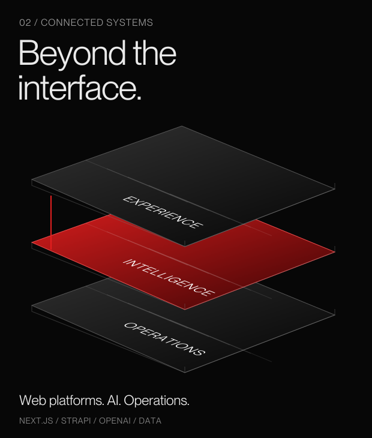
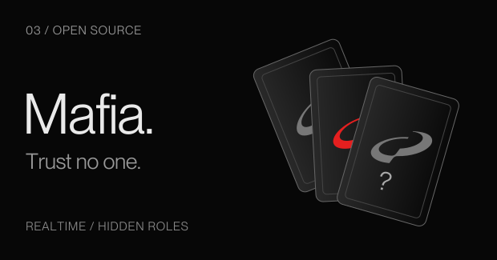
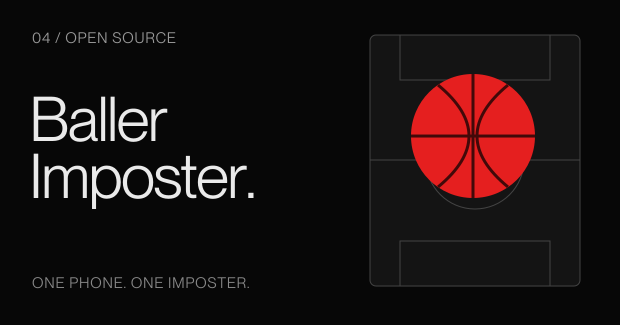

<a href="https://www.underpond.io">
<picture>
<source media="(prefers-reduced-motion: reduce)" srcset="./assets/underpond-v2/hero-still.png">

</picture>
</a>

I turn an early idea into a product people can use. <a href="https://www.underpond.io"><strong>Underpond</strong></a> · <a href="#selected-work">Selected work</a> · <a href="#the-build-trace">Build trace</a> · <a href="https://github.com/RexDotDev?tab=repositories">Repositories</a>

<table>
<tr>
<td width="50%" valign="top">

<a href="https://apps.apple.com/rs/app/winnerarc/id6746265207">App Store</a> · <a href="https://play.google.com/store/apps/details?id=com.winnerarc.application">Google Play</a>

</td>
<td width="50%" valign="top">

<strong>Explore the systems</strong>

 

<strong>Property discovery:</strong> bilingual Dubai platform with search, maps, CMS, localization, and lead capture.

<strong>Business advisory:</strong> service discovery and lead generation connected to content operations.

<strong>Service AI:</strong> questions become prices, bookings, and pickup requests connected to fleet planning.

My work spans product flows, frontend, backend, CMS, and integrations.

</td>
</tr>
<tr>
<td width="50%" valign="top">

<a href="https://github.com/RexDotDev/mafia">Explore the source</a>

</td>
<td width="50%" valign="top">

<a href="https://baller-imposter-game.vercel.app">Play a round</a> · <a href="https://github.com/RexDotDev/baller-imposter-game">Source</a>

</td>
</tr>
</table>

<strong>The tools behind the work</strong>

 

<strong>Interfaces:</strong> TypeScript · React · Next.js · React Native · Expo 
<strong>Systems:</strong> Node.js · Python · PostgreSQL · Supabase · Firebase · Strapi 
<strong>Intelligence & delivery:</strong> OpenAI · Twilio · Vercel · Cloudflare · GitHub Actions

 

