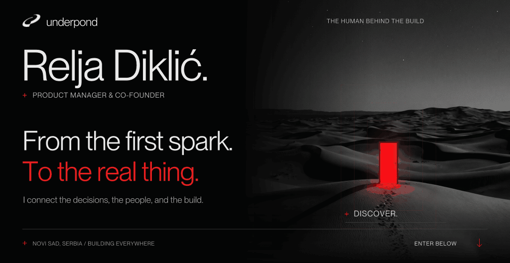
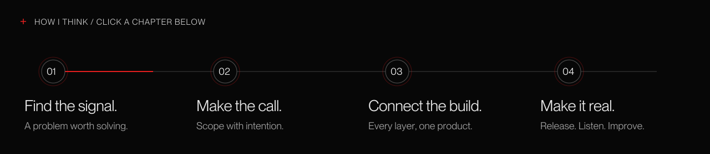
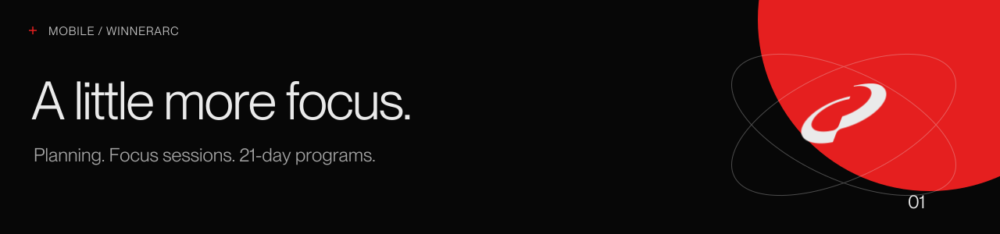
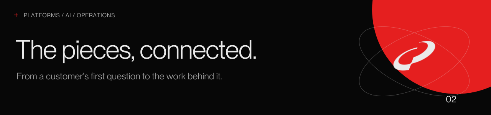
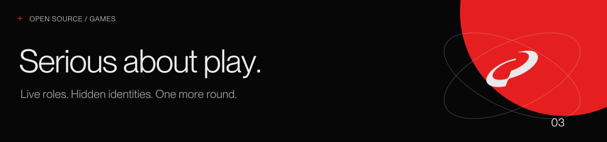
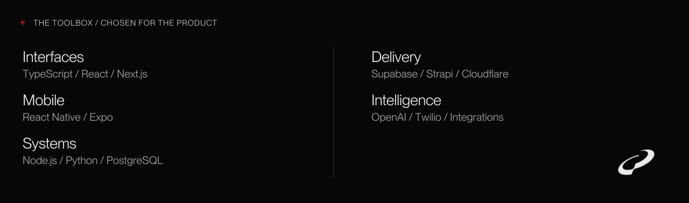
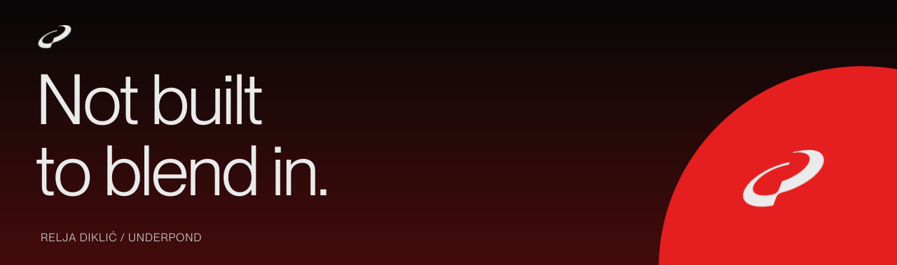

  <a href="#choose-your-way-in">
    <picture>
    <source media="(prefers-reduced-motion: reduce)" srcset="./assets/underpond/hero-still.png">
    
    </picture>
  </a>

<h1 align="center">Relja Diklić</h1>

  <strong>Product Manager &amp; Co-Founder at <a href="https://www.underpond.io">Underpond</a></strong> 
  I connect product direction with the people and engineering that make it real. 
  Based in Novi Sad. Working across web, mobile, and connected systems.

<h2 align="center" id="choose-your-way-in">Choose your way in.</h2>

  <a href="#inside-the-build"><strong>01 / The product mind</strong></a>  
  <a href="#out-in-the-world"><strong>02 / The work</strong></a>  
  <a href="#your-turn"><strong>03 / The play room</strong></a>

 

## Inside the build.

A product starts long before the first line of code. My role is to bring clarity to the idea, make the tradeoffs, and stay close enough to the build to carry those decisions through.

<strong>01 / Find the signal.</strong> What is actually worth building?

 

I start with the problem, the people facing it, and the business behind it. The goal is a shared direction: what needs to improve, why it matters, and how we will recognize progress.

**Discovery → Product direction → Success criteria**

<strong>02 / Make the call.</strong> What earns a place in the release?

 

I turn ambiguity into useful journeys, priorities, and a scope the team can deliver. Every addition has a cost. Sometimes the most valuable decision is the feature we leave out.

**User journeys → Priorities → Release scope**

<strong>03 / Connect the build.</strong> How do the pieces work together?

 

I work hands-on across interfaces, mobile apps, services, data, and integrations. A decision in one layer affects the others, so I keep product intent connected to implementation.

**Web & mobile → Backend & data → AI & integrations**

<strong>04 / Make it real.</strong> What happens when people use it?

 

I care about the important journeys working reliably, the team knowing how to maintain the product, and feedback having a path back into the next release.

**Validation → Delivery → Feedback**

 

## Out in the world.

A few products I have helped shape and build. Different constraints, with the same responsibility to make the whole experience work.

### WinnerArc

A productivity app that connects daily plans, focus timers, 21-day programs, progress, and reminders. Built for iOS and Android, with subscriptions integrated into the experience.

**React Native · Expo · Firebase · Redux · React Query**

[View on the App Store](https://apps.apple.com/rs/app/winnerarc/id6746265207) · [Get it on Google Play](https://play.google.com/store/apps/details?id=com.winnerarc.application)

 

### Where the interface meets the operation.

<strong>Property discovery, connected.</strong> Explore the platform.

 

A bilingual real estate platform for Dubai, bringing property search, maps, localization, lead forms, and CMS-managed content into one experience. My work spans the frontend, content platform, integrations, SEO, and monitoring.

**Next.js · TypeScript · Strapi · Maps · Localization**

<strong>Clear services. A useful next step.</strong> Explore the advisory work.

 

A bilingual UAE business advisory platform built around service discovery, understandable content, and lead capture. The work connects the public website with the content operations that keep it useful.

**Next.js · TypeScript · Strapi · Motion · SEO**

<strong>From a conversation to a completed request.</strong> Explore the AI system.

 

An AI service assistant that answers questions, calculates prices, and books pickup and delivery. Requests connect to route planning, fleet scheduling, and an operations dashboard.

**OpenAI · TypeScript · Maps · Automation**

 

### Build something people want another round of.

**Mafia** brings hidden roles, private rooms, night actions, voting, narration, and chat into a real-time multiplayer game. Built with TypeScript, React, and Supabase.

[Open the Mafia repository](https://github.com/RexDotDev/mafia)

**Baller Imposter** turns one phone into a basketball party game, with NBA and EuroLeague modes, custom roles, and player or team rounds. Built with TypeScript, React, and Vite.

[Play Baller Imposter](https://baller-imposter-game.vercel.app) · [Explore the source](https://github.com/RexDotDev/baller-imposter-game)

 

<strong>Under the hood.</strong> Open the toolbox.

 

Tools follow the product. My work also includes Firebase, Vercel, REST APIs, storage, testing, observability, and deployment workflows.

 

## Your turn.

### Would you ship it?

Three small decisions from the space between product and engineering. Make your call, then open the release note.

<strong>01 / Launch is tomorrow. Checkout fails for some users.</strong>

 

**A.** Launch. Most users are fine. 
**B.** Fix and verify the payment path. 
**C.** Put a warning on the homepage.

Open the release note.

 

**My call: B.** A core journey is a release gate. Fix the failure, verify the path, then make the launch decision.

<strong>02 / A promising new feature doubles the first release’s scope.</strong>

 

**A.** Test the need before expanding scope. 
**B.** Add it. More features mean more value. 
**C.** Cut another feature at random.

Open the release note.

 

**My call: A.** Find evidence for the need and understand the tradeoff. Protect a useful first release while you learn.

<strong>03 / The AI demo is excellent. The provider goes offline.</strong>

 

**A.** Keep retrying without a limit. 
**B.** Hide the error and show success. 
**C.** Offer a clear fallback and bounded retries.

Open the release note.

 

**My call: C.** The fallback is part of the product. People still need a useful next step when a dependency fails.

 

There is a person behind every product decision. Now you know a little more about this one.

 

  <a href="https://www.underpond.io"><strong>Discover Underpond</strong></a> &nbsp; · &nbsp;
  <a href="https://github.com/RexDotDev?tab=repositories"><strong>Explore the repositories</strong></a> &nbsp; · &nbsp;
  <a href="#choose-your-way-in"><strong>Back to the surface</strong></a>

